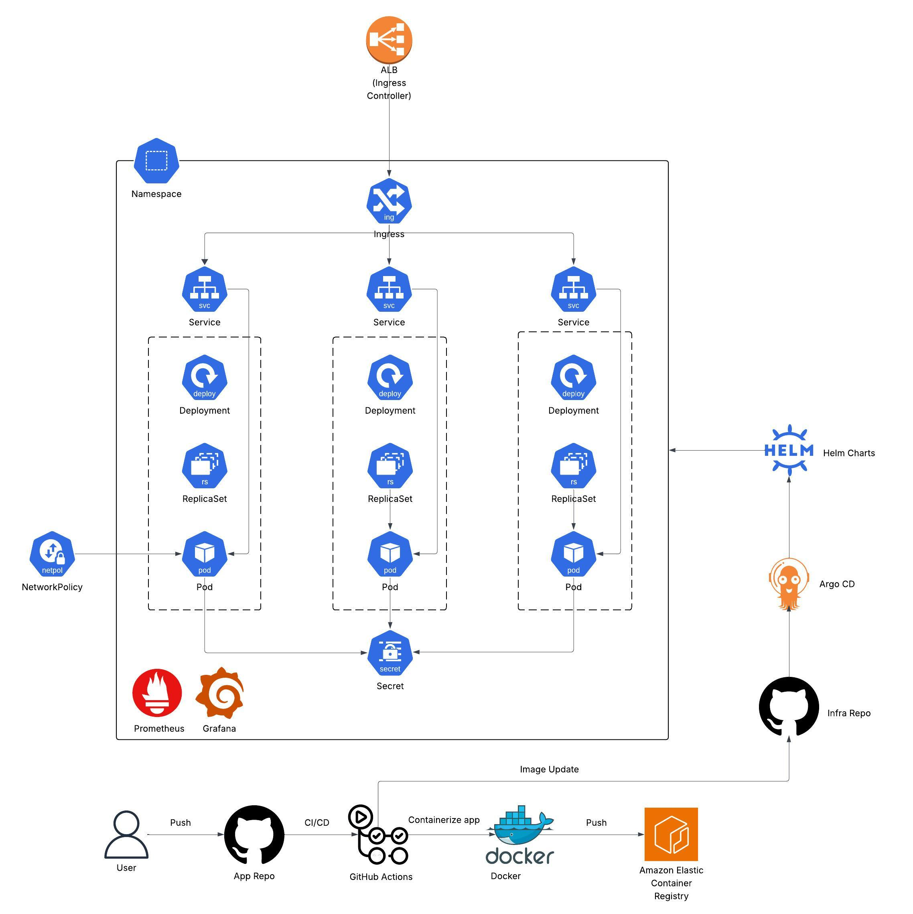

# Kubernetes Infrastructure Documentation Plan
## Project Overview
This project demonstrates a production-grade microservices architecture deployed on Kubernetes, following modern DevOps and GitOps best practices. 
It simulates a banking system composed of loosely coupled services — each handling different business functionalities such as account management, loans, and card issuance. 
The goal is to showcase infrastructure automation, monitoring, and continuous delivery workflows using real-world tools and patterns.

## CI Pipeline - Building and Pushing Docker images

Each microservice repository (e.g., accounts, loans, cards) includes a GitHub Actions workflow for Continuous Integration. This pipeline is responsible for compiling the Java code, building a Docker image, and pushing it to Amazon ECR.

### Workflow Overview
Workflow file: .github/workflows/ci.yml
Triggers: Runs on push to main or develop branches.

### Pipeline Steps
**1. Checkout Code**

Fetches the latest commit from the repository.

```
- name: Checkout source code
  uses: actions/checkout@v4
```

**2. Set Up Java 21 Environment**

Configures Java using Temurin distribution.

```
- name: Set up JDK
  uses: actions/setup-java@v4
  with:
    distribution: 'temurin'
    java-version: '21'
```

**3. Build with Maven (Tests Skipped)**

Compiles the Spring Boot application. Environment variables for the build are passed securely from GitHub Actions vars.

```
- name: Build with Maven
  run: ./mvnw clean install -DskipTests
  env:
    DB_HOST: ${{ vars.DB_HOST }}
    DB_NAME: ${{ vars.DB_NAME }}
    DB_USERNAME: ${{ vars.DB_USERNAME }}
    DB_PASSWORD: ${{ vars.DB_PASSWORD }}
```

**4. Configure AWS Credentials**

Grants access to AWS using credentials stored in GitHub Secrets.

```
- name: Set Up AWS Credentials
  uses: aws-actions/configure-aws-credentials@v3
  with:
    aws-access-key-id: ${{ secrets.AWS_ACCESS_KEY_ID }}
    aws-secret-access-key: ${{ secrets.AWS_SECRET_ACCESS_KEY }}
    aws-region: ${{ secrets.AWS_REGION }}
```

**5. Log In to Amazon ECR**

Logs in to Amazon ECR (Elastic Container Registry), allowing Docker commands to push images to your private container registry.
```
- name: Log in to Amazon ECR
  uses: aws-actions/amazon-ecr-login@v2
```

**6. Generate Image Tag from Git Commit SHA**

Uses Git to extract the current commit's short SHA (ab1b2c3d etc) and sets it as an environment variable IMAGE_TAG. This ensures that each image pushed to ECR is versioned with the commit that produced it.
```
- name: Extract Git commit SHA
  run: echo "IMAGE_TAG=$(git rev-parse --short HEAD)" >> $GITHUB_ENV
```

**7. Build and Tag Docker Image**

First builds the Docker image locally. Then tags it with the full ECR repository path so it’s ready for upload.
```
- name: Build Docker image
  run: |
    docker build -t ${{ secrets.ECR_REPOSITORY }}:${{ env.IMAGE_TAG }} .

- name: Tag Docker image
  run: |
    docker tag ${{ secrets.ECR_REPOSITORY }}:${{ env.IMAGE_TAG }} \
    ${{ secrets.AWS_ACCOUNT_ID }}.dkr.ecr.${{ secrets.AWS_REGION }}.amazonaws.com/${{ secrets.ECR_REPOSITORY }}:${{ env.IMAGE_TAG }}
```

**8. Push Image to ECR**

Uploads the Docker image to your ECR registry so it can be deployed by Kubernetes or ArgoCD.
```
- name: Push Docker image to Amazon ECR
  run: |
    docker push ${{ secrets.AWS_ACCOUNT_ID }}.dkr.ecr.${{ secrets.AWS_REGION }}.amazonaws.com/${{ secrets.ECR_REPOSITORY }}:${{ env.IMAGE_TAG }}
```

## AWS Infrastructure Setup with Terraform
This project uses Terraform to provision all AWS infrastructure required to deploy and operate microservices on Kubernetes (EKS). The infrastructure is modular and supports multi-environment setups (e.g., dev, prod).


### VPC (Virtual Private Cloud)
A custom VPC is provisioned to securely isolate infrastructure components and support high availability across multiple Availability Zones. It includes:

**Public Subnets:**

- Host the Application Load Balancer (ALB) for routing external traffic to backend services.

- Connected to an Internet Gateway (IGW) to enable inbound and outbound internet access.

**Private Subnets(app):**

- Host the Spring Boot microservices running in EKS worker nodes.

- Not directly accessible from the internet, ensuring an added layer of security.

- Outbound access is enabled via NAT Gateways for downloading dependencies and updates.

**Private Subnets(db):**

- Dedicated private subnets for the RDS PostgreSQL database.

- Access is restricted to application subnets through security groups and routing rules.

**Route Tables:**

- Public subnets are associated with routes to the IGW.

- Private subnets use route tables that route through NAT gateways for secure egress.

This VPC design follows AWS best practices by separating tiers (load balancer, application, database) into isolated subnet groups, enabling fine-grained control over traffic flow and security boundaries.

### EKS (Elastic Kubernetes Service)
The EKS module provisions:

An EKS cluster

One or more managed node groups

Kubernetes config output to authenticate kubectl

```
aws eks --region <region> update-kubeconfig --name <cluster-name>
kubectl get nodes
You can now interact with the cluster from your terminal using kubectl.
```

### RDS (PostgreSQL Database)

A PostgreSQL instance is provisioned via RDS in a private subnet and is only accessible from the Spring Boot application's security group, ensuring secure and controlled database access.

**Database Security Group (RDS PostgreSQL):**

- Allows inbound connections only from the EKS security group on the database port (e.g., 5432).

- Denies all other external access by default.

### AWS Load Balancer Controller with IAM & OIDC (IRSA)

To enable dynamic provisioning of Application Load Balancers (ALBs) in Kubernetes using Ingress, we use the AWS Load Balancer Controller deployed via Helm and securely authenticated using IAM Roles for Service Accounts (IRSA).

#### IAM & OIDC Integration**

Instead of granting AWS permissions to every EKS worker node, we follow best practices by enabling fine-grained IAM permissions at the service account level using OIDC.

**1. Fetch OIDC Provider:**

Retrieves the OIDC provider created by EKS to allow federated identity mapping between IAM roles and Kubernetes service accounts.

```
data "aws_iam_openid_connect_provider" "this" {
  url = var.oidc_provider_url
}
```

**2. IAM Policy for the Load Balancer Controller:**

Defines all necessary AWS API permissions required by the controller. The policy is loaded from a static JSON file.

```
resource "aws_iam_policy" "alb_controller" {
  name   = "AWSLoadBalancerControllerIAMPolicy"
  policy = file("${path.module}/iam-policy-alb-controller.json")
}
```

**3. IAM Role for Service Account:**

Creates a role that the Kubernetes service account can assume. It trusts the EKS OIDC provider and restricts usage to the specific service account:

```
resource "aws_iam_role" "alb_controller_irsa" {
  name = "AmazonEKSLoadBalancerControllerRole"

  assume_role_policy = jsonencode({
    Version = "2012-10-17",
    Statement = [{
      Effect = "Allow",
      Principal = {
        Federated = data.aws_iam_openid_connect_provider.this.arn
      },
      Action = "sts:AssumeRoleWithWebIdentity",
      Condition = {
        StringEquals = {
          "${data.aws_iam_openid_connect_provider.this.url}:sub" = "system:serviceaccount:kube-system:aws-load-balancer-controller"
        }
      }
    }]
  })
}
```

**4. Attach IAM Policy to Role:**

```
resource "aws_iam_role_policy_attachment" "alb_attach" {
  role       = aws_iam_role.alb_controller_irsa.name
  policy_arn = aws_iam_policy.alb_controller.arn
}
```

**5. Kubernetes Service Account (with IAM Role Annotation):**

Creates the corresponding Kubernetes ServiceAccount in the kube-system namespace and binds it to the IAM role using the eks.amazonaws.com/role-arn annotation.

```
resource "kubernetes_service_account" "alb_controller" {
  metadata {
    name      = "aws-load-balancer-controller"
    namespace = "kube-system"
    annotations = {
      "eks.amazonaws.com/role-arn" = aws_iam_role.alb_controller_irsa.arn
    }
  }
}
```

**6. Helm Release: AWS Load Balancer Controller:**

Installs the controller into the cluster using Helm, ensuring:

- It uses the existing service account (create=false)

- VPC and cluster name are provided

- Uses ECR-hosted container image

```
resource "helm_release" "alb_controller" {
  name       = "aws-load-balancer-controller"
  chart      = "aws-load-balancer-controller"
  repository = "https://aws.github.io/eks-charts"
  namespace  = "kube-system"
  version    = "1.7.1"

  set {
    name  = "clusterName"
    value = var.cluster_name
  }

  set {
    name  = "serviceAccount.create"
    value = "false"
  }

  set {
    name  = "serviceAccount.name"
    value = "aws-load-balancer-controller"
  }

  set {
    name  = "region"
    value = var.region
  }

  set {
    name  = "vpcId"
    value = var.vpc_id
  }

  set {
    name  = "image.repository"
    value = "602401143452.dkr.ecr.${var.region}.amazonaws.com/amazon/aws-load-balancer-controller"
  }
}
```

#### About the IAM Policy
The IAM policy attached to the controller allows it to:

- Create and manage ALBs, Target Groups, Listeners, Rules, etc.

- Modify and tag security groups

- Interact with AWS WAF, ACM, and Shield

- View or modify EC2 and networking resources relevant to load balancing

This policy can be referenced from the official AWS Load Balancer Controller documentation and should be kept updated for compatibility with new features or services.

#### Benefits of This Setup
- **Security:** Follows least-privilege access with scoped permissions via IRSA

- **Scalability:** Automatically provisions ALBs for Kubernetes Ingress resources

- **Automation:** Fully managed via Terraform and Helm

## Kubernetes Resource Deployment on EKS



