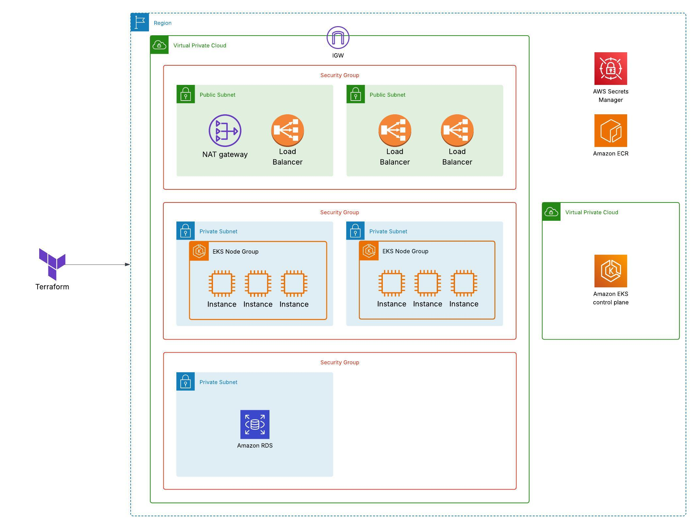
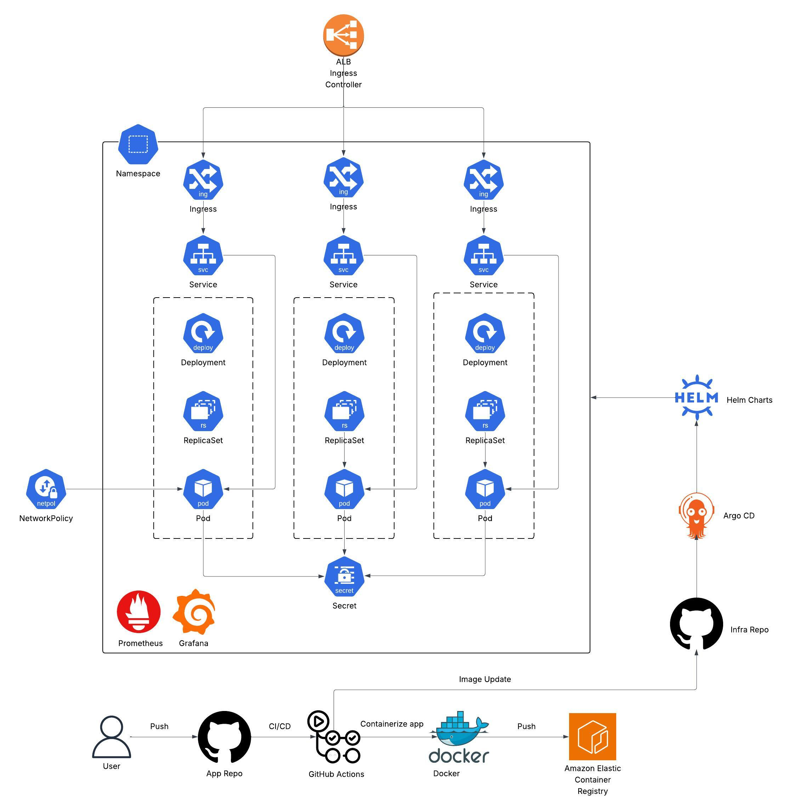

# Kubernetes Microservices Infrastructure on AWS

This project demonstrates a production-grade infrastructure for deploying a containerized banking system to Amazon EKS, using **Terraform**, **Helm**, **GitHub Actions**, and **ArgoCD**. It follows cloud-native and GitOps best practices.

## Architecture Overview

- Multi-service architecture (Accounts, Loans, Cards)
- EKS for container orchestration
- RDS PostgreSQL for persistent storage
- ALB Ingress Controller for external routing
- VPC, security groups and network policies for security
- Horizontal Pod Autoscaling and multiple availability zones for scalability and high availability
- Prometheus and Grafana for monitoring and observability
- GitHub Actions for CI(Continuous Integration): building and pushing Docker images onto ECR
- Argo CD for GitOps-based CD(Continuous Deployment)

## Features & Implementation

- ✅ CI pipeline builds and pushes images to Amazon ECR
- ✅ Terraform provisions VPC, EKS, RDS, and ALB
- ✅ Helm charts for each microservice
- ✅ Secrets and image pull setup for ECR/RDS
- ✅ HPA for auto-scaling based on CPU/memory
- ✅ Prometheus + Grafana monitoring stack
- ✅ Storing secrets externally
- In progress: Argo CD GitOps integration and CD pipeline
- In progress: Network policies for security between pods

## Tech Stack

- **AWS**: Amazon EKS, Amazon RDS, Amazon VPC, ALB Controller, Amazon ECR)
- **Infrastructure as Code**: Terraform 
- **CI/CD and GitOps**: GitHub Actions, Argo CD 
- **Containerization and Orchestration**: Docker, Kubernetes, Helm
- **Monitoring**: Prometheus, Grafana
- **Backend**: Spring Boot (Java 17), PostgreSQL

## Documentation

- [CI pipeline with GitHub Actions](docs/ci-pipeline.md)
- [AWS Infrastructure](docs/aws-infrastructure.md)
- [AWS ALB Ingress Controller](docs/alb-ingress-controller.md)
- [Managing external Secrets](docs/external-secrets.md)
- [Continuous Deployment with ArgoCD](docs/cd-pipeline.md)
- [Monitoring and Observability with Prometheus and Grafana](docs/monitoring-and-observability.md)
- [Testing(using local ingress)](docs/local-ingress-testing.md)

