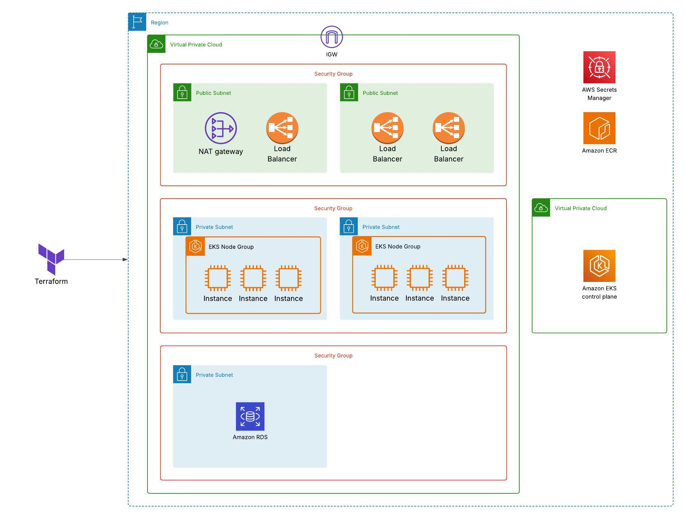

# AWS Infrastructure Setup with Terraform
This project uses Terraform to provision all AWS infrastructure required to deploy and operate microservices on Kubernetes (EKS). The infrastructure is modular and supports multi-environment setups (e.g., dev, prod).



## VPC (Virtual Private Cloud)
A custom VPC is provisioned to securely isolate infrastructure components and support high availability across multiple Availability Zones. It includes:

**Public Subnets:**

- Host the Application Load Balancer (ALB) for routing external traffic to backend services.

- Connected to an Internet Gateway (IGW) to enable inbound and outbound internet access.

**Private Subnets(app):**

- Host the Spring Boot microservices running in EKS worker nodes.

- Not directly accessible from the internet, ensuring an added layer of security.

- Outbound access is enabled via NAT Gateways for downloading dependencies and updates.

**Private Subnets(db):**

- Dedicated private subnets for the RDS PostgreSQL database.

- Access is restricted to application subnets through security groups and routing rules.

**Route Tables:**

- Public subnets are associated with routes to the IGW.

- Private subnets use route tables that route through NAT gateways for secure egress.

This VPC design follows AWS best practices by separating tiers (load balancer, application, database) into isolated subnet groups, enabling fine-grained control over traffic flow and security boundaries.

## EKS (Elastic Kubernetes Service)
This Terraform module provisions a production-ready **Amazon Elastic Kubernetes Service (EKS)** cluster using the community-maintained [`terraform-aws-modules/eks/aws`](https://registry.terraform.io/modules/terraform-aws-modules/eks/aws/latest) module.

It manages the control plane, networking, IAM roles, node groups, Kubernetes add-ons, and associated security groups — all following AWS and Kubernetes best practices. Here is a list of components created using the module:

### 1. EKS Control Plane
- Deploys a managed Kubernetes control plane via EKS.
- Kubernetes version: `1.29`
- Public API endpoint access enabled (`cluster_endpoint_public_access = true`).
- Cluster creator gets `cluster-admin` permissions (`enable_cluster_creator_admin_permissions = true`).

### 2. Networking
- Deploys into a custom VPC (`module.vpc.vpc_id`).
- Uses **private subnets** for node groups:  
  `module.vpc.private_subnet_a_id` and `module.vpc.private_subnet_b_id`.

### 3. Node Groups 
- **EKS Managed Node Group** named `dev_nodes`:
  - Instance type: `t3.medium` (via `eks_managed_node_group_defaults`)
  - AMI type: `AL2023_x86_64_STANDARD`
  - Auto-scaling: 1–3 nodes (`min_size`, `max_size`, `desired_size`)
  - Private networking only (no public IPs by default)

### 4. Cluster Add-ons
- Installs core Kubernetes add-ons managed by EKS:
  - `coredns`
  - `kube-proxy`
  - `vpc-cni`

These are essential for service discovery, pod networking, and API proxying.

### 5. Security Groups

The module creates and manages several Security Groups:

**Cluster Security Group** 
- Controls **EKS control plane** traffic.
- Required for:
  - API server → kubelet (port 10250)
  - Admission webhooks or metrics servers
- Exposed via: `module.eks.cluster_primary_security_group_id`

**Managed Node Group Security Group**
- Controls traffic between worker nodes and to/from the control plane.
- Allows:
  - Node-to-node communication
  - Control plane → worker node communication
- Can be customized or reused using `node_security_group_id`.

### Kubernetes config output to authenticate kubectl 

```
aws eks --region <region> update-kubeconfig --name <cluster-name>
kubectl get nodes
You can now interact with the cluster from your terminal using kubectl.
```

## RDS (PostgreSQL Database)

A PostgreSQL instance is provisioned via RDS in a private subnet and is only accessible from the Spring Boot application's security group, ensuring secure and controlled database access.

**Database Security Group (RDS PostgreSQL):**

- Allows inbound connections only from the EKS security group on the database port (e.g., 5432).

- Denies all other external access by default.

## Security Groups

Security groups are configured to enforce strict network segmentation between the public-facing ALB, internal microservices running on EKS, and the backend PostgreSQL RDS database. This ensures **least privilege access** and reduces the attack surface of the infrastructure.

### ALB Security Group (`alb-sg`)

This security group is associated with the Application Load Balancer. It allows public access and enables routing to microservices running on private EKS worker nodes.

- **Ingress Rules:**
  - Allow HTTP (`port 80`) from anywhere (`0.0.0.0/0`)
  - Allow HTTPS (`port 443`) from anywhere (`0.0.0.0/0`)

- **Egress Rules:**
  - Allow all outbound traffic (`0.0.0.0/0`) for ALB health checks and backend communication

### ALB → EKS Node Group Rules

To allow traffic from the ALB to reach the Spring Boot microservices inside the EKS cluster, specific ingress rules are added to the **EKS node group security group** (`module.eks.node_security_group_id`).

These rules allow traffic only **from the ALB security group**:

- Port **8080** – typically used for general app traffic (e.g., REST APIs)
- Port **8090** – can be used for sidecar services or secondary microservices
- Port **9000** – may serve administrative interfaces or alternate service ports

This approach ensures that **only the ALB** can reach the applications on these ports, not the wider internet.

### RDS Security Group (`rds-sg`)

This group is associated with the PostgreSQL database provisioned via RDS. It restricts access to **only the EKS worker nodes**, ensuring that the database is never publicly accessible.

- **Ingress Rules:**
  - Allow PostgreSQL traffic (`port 5432`) **only from the EKS node security group**

- **Egress Rules:**
  - Allow all outbound traffic to enable database updates and AWS services (optional, can be scoped tighter)

### Security Design Summary

| Source        | Destination     | Port(s) | Purpose                                |
|---------------|------------------|---------|----------------------------------------|
| `0.0.0.0/0`   | ALB              | 80/443  | Public web access to the load balancer |
| ALB SG        | EKS Nodes        | 8080    | Microservice HTTP traffic              |
| ALB SG        | EKS Nodes        | 8090    | Microservice HTTP traffic              |
| ALB SG        | EKS Nodes        | 9000    | Microservice HTTP traffic              |
| EKS Node SG   | RDS              | 5432    | Secure database access                 |

This layered security model aligns with AWS well-architected guidelines and ensures **controlled communication paths** between components.